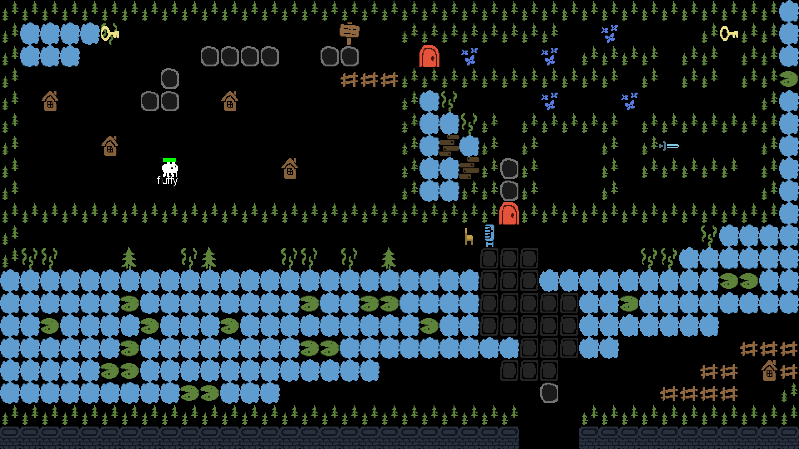
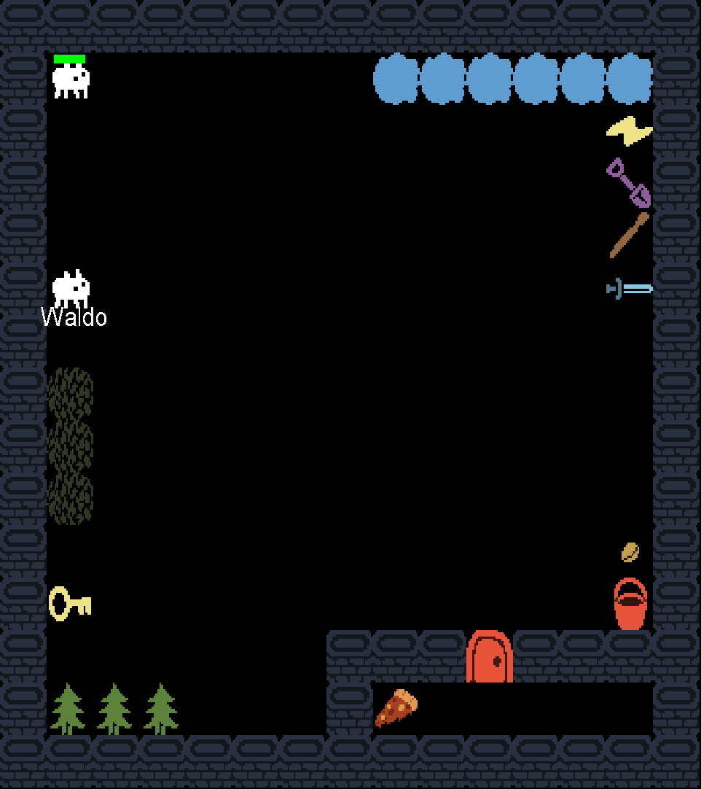

# The Big Adventure
First Java project made with [Nelson De Oliveira](https://github.com/NellMili).

___

This is a meta-game, where the player can either enjoy playing and creating his own worlds.

This is our first project in java for the last year of our bachelor degree. This document resume the subjets and goal, but the original subject can be found [here](https://monge.univ-mlv.fr/ens/Licence/L3/2023-2024/Java/project.php).

For assets, we used images from the [Baba Is You](https://en.wikipedia.org/wiki/Baba_Is_You) game.


*Map from [demo.map](maps/demo.map)*

# Table of Contents

- [The Big Adventure](#the-big-adventure)
- [Table of Contents](#table-of-contents)
  - [How to](#how-to)
    - [Donwload](#donwload)
    - [Compile](#compile)
    - [Run](#run)
  - [Creating your world](#creating-your-world)
    - [Map format](#map-format)
    - [Attributes](#attributes)
  - [Playing your world](#playing-your-world)
  - [Controls](#controls)
  - [Features](#features)
  
## How to

### Donwload

To download the repo, you can either:
* download the .zip archive and unzip-it to create a directory called *TheBigAdventure*
* Use git command described bellow to automatically create the *TheBigAdventure* directory
  
```shell
git clone https://github.com/GouruRK/GemCraft
```
*Downloading the repository using git*

### Compile

This project needs **Java 21** to be compiled and used.

Except from an IDE which automatically compile and run it, we used [Ant](https://ant.apache.org/manual/index.html), which you can download following the previous link, or by using this commands :

```shell
sudo apt-get update
sudo apt-get install ant
```

With [Ant](https://ant.apache.org/manual/index.html) installed and while in the *TheBigAdventure* directory, use the default ant target to create a jar file called *thebigadventure.jar* file.

```shell
cd TheBigAdventure
ant
```

Here are some other targets supported by the `build.xml` file:

* `ant clean`: removes `.classes` files
* `ant compile`: creates `.classes` files
* `ant jar`: creates the *thebigadventure.jar* file
* `ant javadoc`: creates the `docs/api` folders with documentation 
> [!NOTE]
> Note that documentation's entry point is `docs/api/index.html` file


### Run

You can run the program using the following command:

```shell
java -jar thebigadventure.jar -- level FILE
```

Note that some arguments are required while others are mandatory

* `-lvl, --level FILE` path to the map to play, mandatory
* `--validate` check if a map syntax is correct without playing it
* `--dry-run` play with still mobs
* `-h, --help` print help and exit

## Creating your world

### Map format

A world is contained in a `.map` file (see [demo.map](maps/demo.map) or [test.map](maps/test.map) if you need examples). A map is composed by types of elements :

* the `grid` one, which specifies generic datas such as dimensions, or tiles, and must have the following structure:
  ```
  [grid]
    size: (w x h)
    encodings: ITEM(I) WEAPON(W)
    data: """
    IIIIIII
    I     I
    I     I
    I     I
    IIIIIII
    """
  ```
* the `element` ones, which indicates mobs, weapon and many ofther things. Elements must follow the structure :
  ```
  [element]
    attribute: value
    attribute: value
  ```

> [!CAUTION]
> We **strongly** recommands you to **not** use tabulation in the `data` attribute.

### Attributes

Here is the list of the possible attributes values

|Attribut|Values|Example|Explanation|
|:-|:-|:-|:-|
|**name**||John|name the element|
|**skin**||CRAB|skin the element. Skins must correspond to images in the [ressources](ressources/images/) directory. Each element must have a skin|
|**player**|true, false||indicate that the player is this element|
|**health**||25|element health|
|**kind**|friend, enemy, item, obstacle||indicate the type of element. If the element's type contradict its skin, element's behaviour will be the one associated with its skin|
|**zone**|(x, y) (w x h)|(0, 0) (5 x 10)|Zone there a mob can move|
|**behavior**|shy, stroll, agressive||behavior of a mob|
|**damage**||10|damages inflict by a weapon|
|**text**|||text, same as the `data` structure|
|**trade**|SKIN -> SKIN, SKIN -> SKIN name, ...|CASH -> KEY red|create a trade table for a friendly mob|
|**locked**|ITEM name|KEY red|an item is required to go through the gate|

Attributes can only be used one by elements. If you give too much attributes useless for the selected type, they will be ignored (like giving a trade table to a sword)

Note that the syntax is pretty rough, and you can easily creates small mistakes while creating your world. The parser will tell you them all. 

## Playing your world

## Controls

When your world is loaded, the camera in centered on your player. The keybinds are the following:

* `z`/`up arrow`: move up
* `q`/`left arrow`: move left
* `s`/`down arrow`: move down
* `d`/`right arrow`: move right
* `i`: toggle your inventory and other interfaces
* `a`: drop your current held item
* `space`: use your current held item, talk to friends, replace an item with the selected one

As you may have guess, there is no use for a mouse in this game

## Features

* Eat to gain food
* Kill non-friendly mobs
* Pick-up items from the ground
* Trade with friends
* Use differents types of weapons
* Open and close gates with the required items
* Different comportements for mobs
* A sword can shop tree and create a box
* A shovel can plant a seed in a grass block
* A bucket can be filled by water and used to grow a sprout or die a fire
* A bolt has infinite damages, has a three blocks range and set tree to fire
* Fire can spread
* Read a book or paper, change pages

___


*Map from [test.map](maps/test.map)*